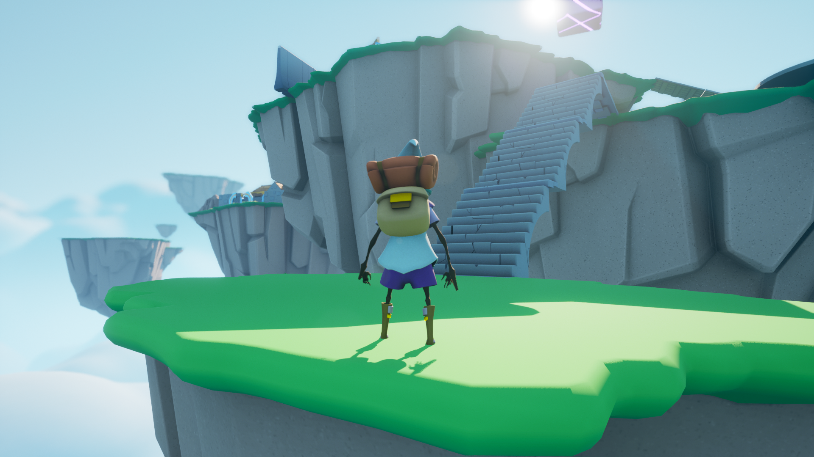
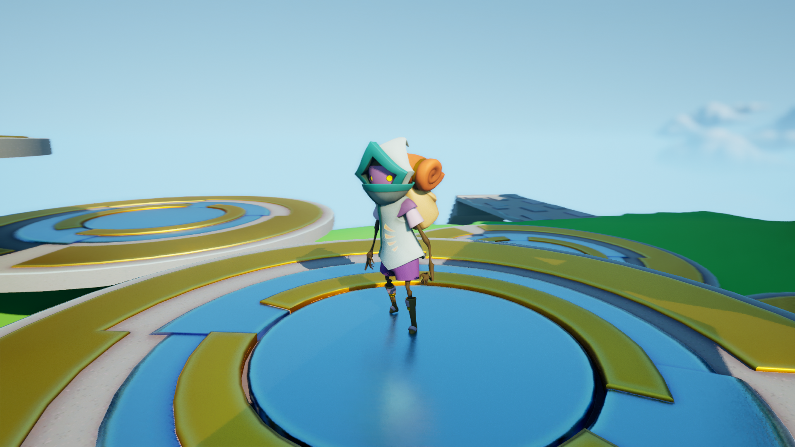
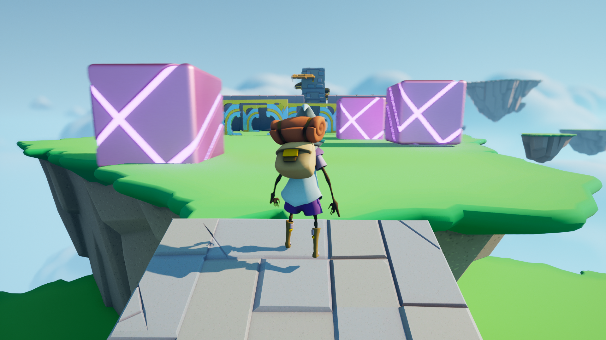
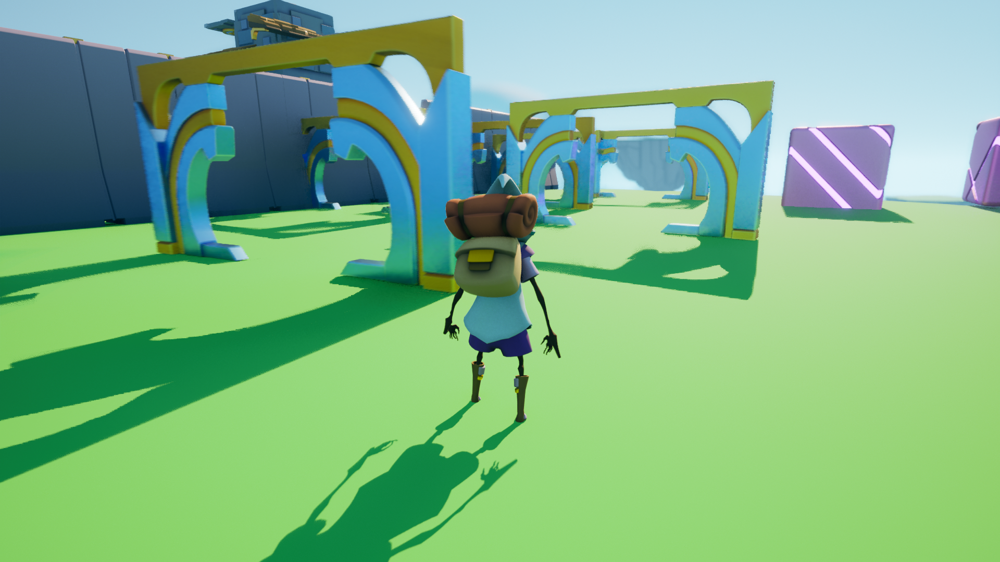
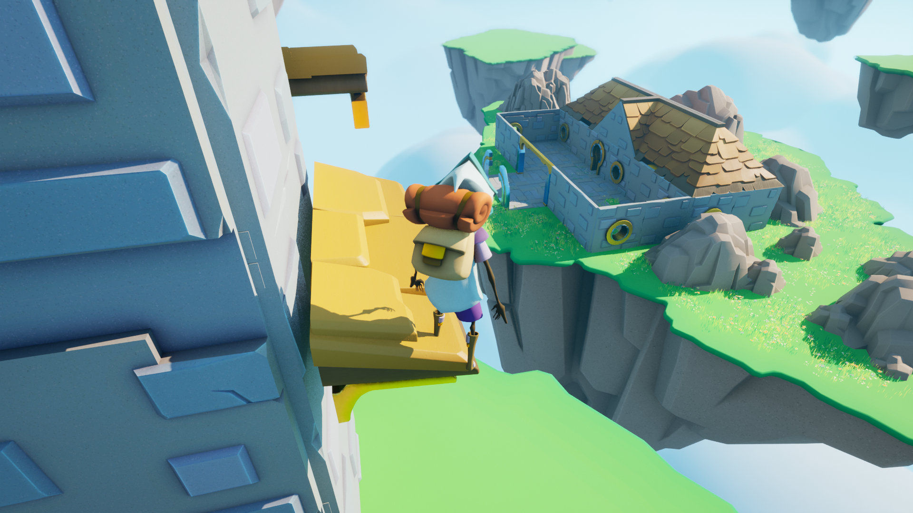
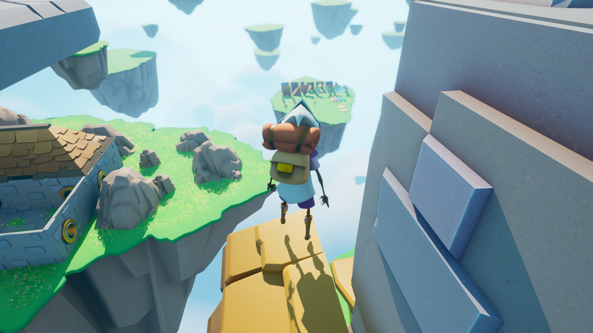
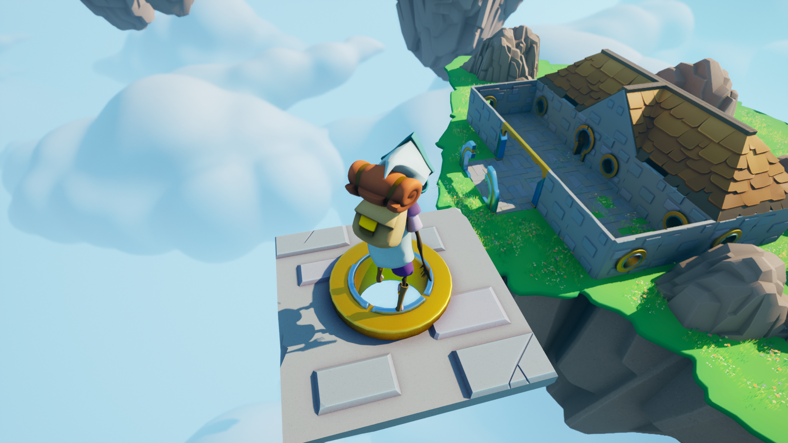
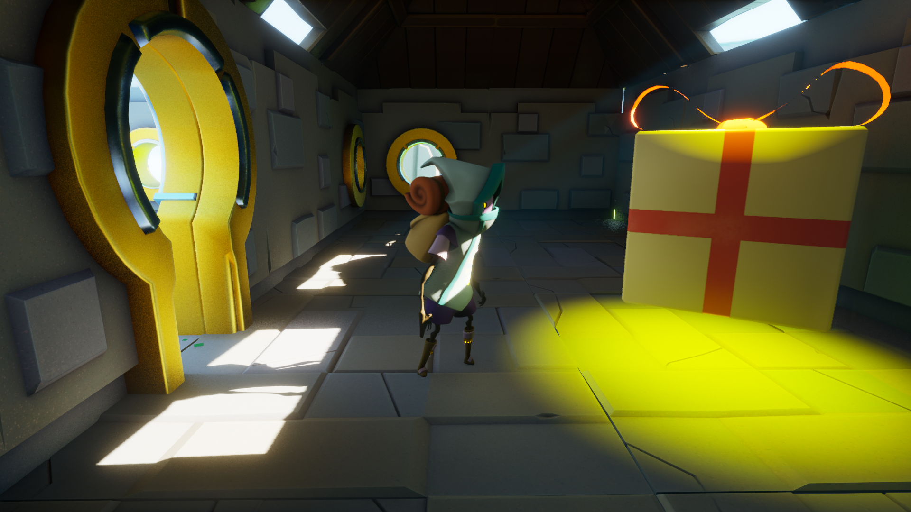

# UnrealCoursePractice2-ObstacleAssasult
 
My practice project from Udemy course :
[Unreal Engine 5 C++ Developer: Learn C++ & Make Video Games](https://www.udemy.com/course/unrealcourse/)

Demo Video : https://youtu.be/TpbsVs7V3eg

